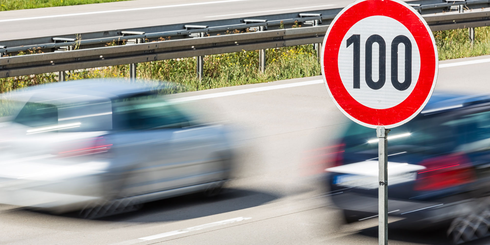

# **Traffic Sign Recognition** 


---

### The Project

Using techniques from deep neural networks and convolutional neural networks I build a neural network classifier to identify German traffic signs. I train and validate a model so it can classify traffic sign images using the [German Traffic Sign Dataset](https://d17h27t6h515a5.cloudfront.net/topher/2017/February/5898cd6f_traffic-signs-data/traffic-signs-data.zip). After the model is trained, I then try out the model on images of German traffic signs that I find on the web.

The goals / steps of this project are:
* Load the data set (see below for links to the project data set)
* Explore, summarize and visualize the data set
* Design, train and test a model architecture
* Use the model to make predictions on new images
* Analyze the softmax probabilities of the new images
* Summarize the results with a written report


[//]: # (Image References)

[signs_palette]: ./visuals/palette.png "Traffic Signs Sample Palette"
[dataset_histograms]: ./visuals/dataset_histograms.png "Dataset historgrams"
[ahead-only]: ./predict_images/32x32/ahead-only.png "Ahead only"
[children-crossing]: ./predict_images/32x32/children-crossing.png "Children crossing"
[speed-30]: ./predict_images/32x32/speed-30.png "Speed limit (30km/h)"
[turn-right-ahead]: ./predict_images/32x32/turn-right-ahead.png "Turn right ahead"
[yield]: ./predict_images/32x32/yield.png "Yield"

---
### Files

1. The Traffic_Sign_Classifier.ipynb notebook file with code cells executed and displaying output:

    [Traffic_Sign_Classifier.ipynb](https://github.com/allen8r/sdc-traffic-sign-classifier/blob/master/Traffic_Sign_Classifier.ipynb)

2. Any additional datasets or images used for the project that are not from the German Traffic Sign Dataset:

    See [Project repo](https://github.com/allen8r/sdc-traffic-sign-classifier).

    The pickled German Traffic Sign Dataset is externally available [here](https://d17h27t6h515a5.cloudfront.net/topher/2017/February/5898cd6f_traffic-signs-data/traffic-signs-data.zip).
   
3. A writeup report in markdown format:

    Here is a link to the [writeup report](https://github.com/allen8r/sdc-traffic-sign-classifier/blob/master/project-writeup.md).

### Dataset Exploration

On the left is a sample palette of all the different traffic signs from the training set. On the right are histograms depicting the distribution of all the types of traffic signs within each dataset: the training, validation, and test sets. The histograms show that the data is a bit heavier on the first 18 or so types of signs from the palette.

| ![alt text][signs_palette] | ![alt_text][dataset_histograms] |
|:--------------------------:|:-------------------------------:|
  
### Design and Test a Model Architecture

#### 1. Preprocessing the image data
First, I normalized the training data by applying the basic RGB image normalization, (pixel - 128.0) / 128.0. As standard practice, data normalization helps in speeding up training and reduces the chance of getting stuck at local optima.

That's it for preprocessing! Instead of converting the training image data to grayscale, at the front of the training pipeline, I decided to apply a 1x1 convolution projection with a [1, 1, 3, 1] filter to transform the 3-channel image data to a single layer image data which turns out to be equivalent to converting to grayscale. See the convolution layer 0 in the model architecture below.

#### 2. Final model architecture
My final model consisted of the following layers:

| Layer         		|     Description	        					                                        | 
|:----------------------|:--------------------------------------------------------------------------------------| 
| Input         		| 32x32x3 RGB image   							                                        | 
| Convolution 0  1x1   	| [1, 1, 3, 1] filter, 1x1 stride, VALID padding, outputs 32x32x1; convert to grayscale	|
| RELU					|												                                        |
| Convolution 1  5x5   	| [5, 5, 1, 20] filter, 1x1 stride, VALID padding, outputs 28x28x20                     |
| RELU					|												                                        |
| Max pooling	      	| 2x2 stride,  outputs 14x14x20 				                                        |
| Convolution 2  5x5    | [5, 5, 20, 36] filter, 1x1 stride, VALID padding, outputs 10x10x36                    |
| RELU					|												                                        |
| Max pooling	      	| 2x2 stride,  outputs 5x5x36 				                                            |
| Fully connected 0	    | flatten Input 5x5x36 to Output 900        									        |
| Fully connected 1	    | Input 900 to Output 1024        									                    |
| Dropout				|												                                        |
| RELU					|												                                        |
| Fully connected 2	    | Input 1024 to Output 512     									                        |
| Dropout				|												                                        |
| RELU					|												                                        |
| Fully connected 3	    | Input 512 to Output 128     									                        |
| Dropout				|												                                        |
| RELU					|												                                        |
| Output                | Input 128 to Output 43 (number of classes)        									|
| Softmax               | tf.nn.softmax_cross_entropy_with_logits                                               |

#### 3. Training the model
To train the model, I used a tf.train.AdamOptimizer. The optimizer was set up to minimize the cross entropy loss provided by tf.nn.sofmax_cross_entropy_with_logits. The following hyperparameters were used for the training:

| Hyperparameter          | Value |
| :-----------------------| -----:|
| Learning rate           | 0.001 |
| Epochs                  |    10 |
| Batch size              |   128 |
| Keep prob (for dropout) |  0.45 |

#### 4. Final model results

My final model results, with validation accuracy of at least 0.93, were:

| Dataset           | Accuracy          |
|:------------------|:------------------|
| Training          | **0.997**         |
| Validation        | **0.965**         | 
| Test              | **0.950**         |


### Testing the Model on New Images

Images were obtained from the web to use as input for the traffic sign classifer. Here are the five German traffic signs:

![alt text][ahead-only] ![alt text][children-crossing] ![alt text][speed-30] 
![alt text][turn-right-ahead] ![alt text][yield]

Here are the prediction results:

| Image			        |     Prediction	        					| 
|:----------------------|:----------------------------------------------| 
| Ahead only      		| Ahead Only   									| 
| Children crossing		| Children crossing								|
| Speed limit (30km/h)	| Speed limit (30km/h)							|
| Turn right ahead      | Turn right ahead                              |
| Yield     			| Yield                                         |


The model was able to correctly guess 5 of the 5 traffic signs, which gives an accuracy of 100%. This compares favorably to the accuracy on the test set of 0.950.


> For a detailed discussion on the model's certainty in prediction classification of each of the five new images see the [project writeup](https://github.com/allen8r/sdc-traffic-sign-classifier/blob/master/project-writeup.md).


---

### Environment
Suggested setup:
* [Anaconda](https://www.anaconda.com/download/) - Python platform for Data Science
* Use conda import of [`environmenmt.txt`](./environment.txt) to replicate the python environment to run the Jupyter Notebook for this project.
```
    conda env create --file environment.txt
```

Alternative:

* [CarND Term1 Starter Kit](https://github.com/udacity/CarND-Term1-Starter-Kit)

The lab environment can be created with CarND Term1 Starter Kit. Click [here](https://github.com/udacity/CarND-Term1-Starter-Kit/blob/master/README.md) for the details.

### Dataset
Download the [data set](https://d17h27t6h515a5.cloudfront.net/topher/2017/February/5898cd6f_traffic-signs-data/traffic-signs-data.zip). This is a pickled dataset in which the images have already been resized to 32x32 pixels. It contains a training, validation and test set.
